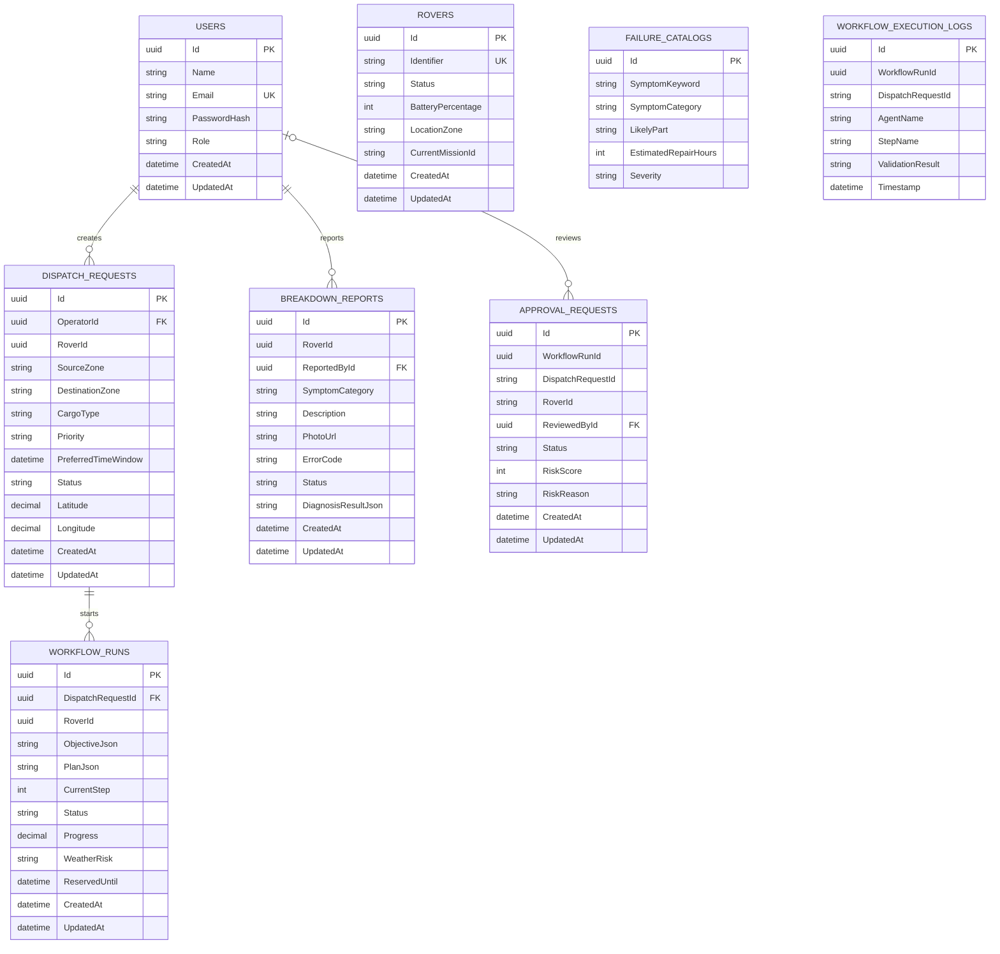

# SmartFleet relational schema (PostgreSQL)

This diagram reflects the EF Core model in `backend/Data/SmartFleetDbContext.cs`. Solid relationships below are **database foreign keys**, not merely matching identifier values. The local PostgreSQL assessment database is created by EF migrations.

`RoverId` in dispatch, workflow and breakdown records is a **logical rover reference without an enforced FK**. `ApprovalRequests.WorkflowRunId`, `WorkflowExecutionLogs.WorkflowRunId`, their `DispatchRequestId` strings, and `Rovers.CurrentMissionId` are also logical references without FKs. The approval row has a unique index on `WorkflowRunId`, while email and rover identifier have unique indexes. Other query indexes are configured in the EF model. This is a schema limitation to fix or justify in the report; the diagram deliberately does not present these logical references as enforced relationships.

The full field types and constraints are in the EF model and migrations. `ObjectiveJson`, `PlanJson`, `DiagnosisResultJson`, agent summaries and execution input/output are serialized text columns, rather than separate normalized tables. They hold workflow evidence and are bounded by application validation; no hidden reasoning, password or API token is intended to be stored there.
