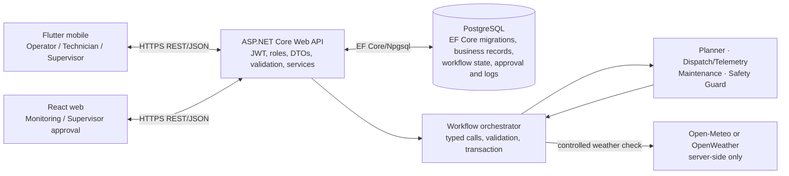
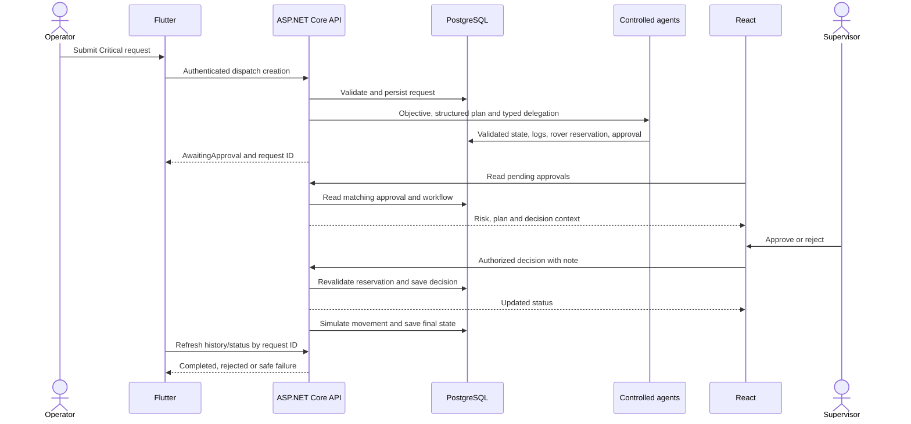

# Integrated SmartFleet architecture and assessed workflow

The warehouse map and rover movement are a database-backed **simulation**, not physical navigation hardware. React and Flutter are separate clients of the same ASP.NET Core API. The API owns authentication, roles, validation, domain rules, PostgreSQL persistence, and the controlled agent workflow. Neither client has a direct database or agent-tool connection.

In the local assessment setup the API and clients use HTTP on `localhost`/Android emulator `10.0.2.2`. HTTPS, restricted cloud credentials, hosted PostgreSQL, live health and Swagger URLs remain deployment work; the diagram shows the intended deployed transport rather than claiming it is already live.

The critical-priority scenario is the required cross-platform demonstration:

The same request ID must be visible in both clients and the persisted workflow. Movement starts only after approval; a rejection or invalidated reservation releases the rover. The agents are deterministic C# components, not an LLM or physical robot controller. See the [agent permission map](agent-tool-permissions.md), [database ER diagram](database-erd.md), and [orchestration ADR](../adr/003-orchestration-and-state.md) for exact implementation limits.
